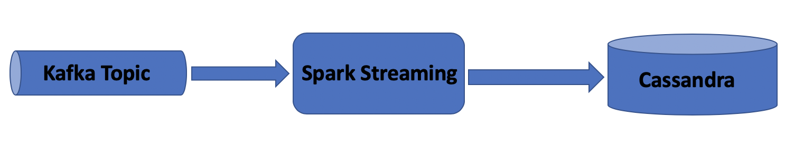
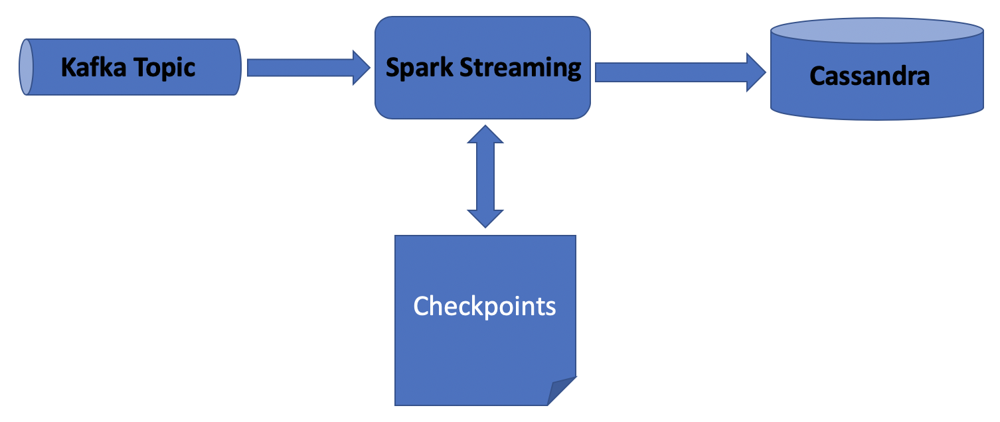

## Kafka Spark Data Pipeline 
This repository is to demonstrate highly scalable and fault tolerant data pipeline for a real-time data stream. We will read the text from kafka topic to process the word count and finally persist the result in cassandra.

## Leveraging Checkpoints

In a stream processing application, it's often useful to retain state between batches of data being processed.

For example, in `WordCounter.java`, we are only able to store the current frequency of the words. What if we want to store the cumulative frequency instead? Spark Streaming makes it possible through a concept called checkpoints.

## Prerequisites
Before we start let's make sure we have the following prerequisites in place
* Java 8
* Maven 3.5
* Docker
* I use IntelliJ IDEA, you can use any other IDE

## Installation

For easy set up of the project environment, I have made use of docker compose to save time and avoid set up related problems. Please note this is not ideal for production setup. 

Please note, I have increased my docker's resources like RAM, CPU and storage to run this example.

## Update Machine IP in docker-compose.yml

Change KAFKA_ADVERTISED_HOST_NAME to your local ip address. 

## Building from source
After completing the prerequisites, you can follow the instructions to build and run the project.

### Clone the Repository

	git clone https://github.com/karasatishkumar/dc-ai-ml-lab.git

### Running the project

###### Compiling the project
    cd kafka-spark-data-pipeline
	mvn clean install
	
###### Bring up Docker	
	docker-compose up
	
###### Setup Cassandra
    docker exec -it cassandra /bin/bash 
    sh cassandra.sh
    cqlsh -u cassandra -p cassandra
    USE vocabulary;
    select * from words;
    
    word | count
    ------+-------
    
    (0 rows)

###### Running the application in Spark Submit Container
    docker exec -it spark-submit /bin/bash
    sh /app/run.sh 
    
###### Running the checkpoints application in Spark Submit Container
    docker exec -it spark-submit /bin/bash
    sh /app/run-checkpoints.sh        

###### Publish text to Kafka Topic
    docker exec -it kafka /bin/bash
    kafka-console-producer.sh --broker-list localhost:9092 --topic messages
    >satish is ag
    
###### Check the Result in Cassandra    
    docker exec -it cassandra /bin/bash 
    cqlsh -u cassandra -p cassandra
    USE vocabulary;
    select * from words;
    
    word   | count
    --------+-------
    satish |     1
        is |     1
        ag |     1
        
###### Bring down Docker        	
	docker-compose down

## Contributing
Pull requests are welcome for improvement.

## Staying in touch

## License

## Release

## Reference

